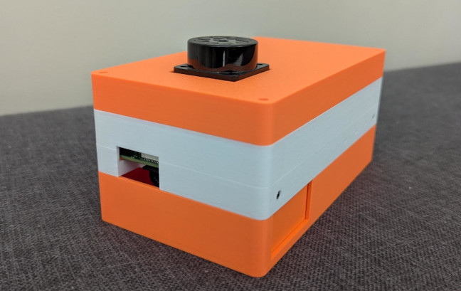

# Portable SLAM

A ROS2 Jazzy package for SLAM using the IMU of Waveshare Sense Hat B and YDLidar.



## Requirements

### Hardware

- Single Board Computer: Raspberry Pi or OrangePi 5
- [Waveshare Sense HAT B](https://www.waveshare.com/wiki/Sense_HAT_(B))
- YDLidar Tmini Pro (can be switch to another YDLidar device)
- Dupont Connector


#### Enabling I2C for the Waveshare Sense HAT B

On Orange Pi 5 with ArmbianOS, the physical pins 3 (SDA) and 5 (SCL) for the 26-pin header are actually connected to I2C-5 controller in the RK3588 SoC, and are configured in mux mode 3.

* Add user overlay of /boot/ArmbianEnv.txt: `user_overlays= rk3588-i2c5-m3`
* Run `sudo armbian-add-overlay ./hw/rk3588/rk3588-i2c5-m3.dts`
* Reboot and recheck if there are some entries with `sudo i2cdetect -y 5`.
* Another alternative to list all of the i2c-bus by running `ls /dev/i2c* | while read line; do id="$(echo $line | cut -d '-' -f 2)"; echo -e "\\n## Detecting i2c ID: $id"; sudo i2cdetect -y $id; done`

See other dts overlay files in https://github.com/orangepi-xunlong/linux-orangepi/tree/orange-pi-5.10-rk3588/arch/arm64/boot/dts/rockchip/overlay

On RaspberryPi with Ubuntu 24.04 Server, the sensor is connected to I2C-1 follow these steps:
1. `sudo raspi-config`
2. Choose "3. Interface Options" -> "I5 I2C" -> select "yes".
3. Reboot and check that `sudo i2cdetect -y 1` returns device addresses on 0x29, 0x48, 0x5c, 0x68, and 0x70.

Overall `sudo i2cdetect -y 5` on Orange Pi 5 or `sudo i2cdetect -y 1` on Raspberry Pi 4 should returns:
```
     0  1  2  3  4  5  6  7  8  9  a  b  c  d  e  f
00:                         -- -- -- -- -- -- -- -- 
10: -- -- -- -- -- -- -- -- -- -- -- -- -- -- -- -- 
20: -- -- -- -- -- -- -- -- -- 29 -- -- -- -- -- -- 
30: -- -- -- -- -- -- -- -- -- -- -- -- -- -- -- -- 
40: -- -- -- -- -- -- -- -- 48 -- -- -- -- -- -- -- 
50: -- -- -- -- -- -- -- -- -- -- -- -- 5c -- -- -- 
60: -- -- -- -- -- -- -- -- 68 -- -- -- -- -- -- -- 
70: 70 -- -- -- -- -- -- --     
```
Where

* 0x29 represents the Color recognition sensor TCS34725
* 0x48 represents the AD conversion ADS1015.
* 0x68 represents the IMU 9-axis sensor ICM-20948.
* 0x5C represents the Air pressure sensor LPS22HB
* 0x70 represents the Temperature and humidity sensor SHTC3

Add user to the group permission of i2c and dialout:

```
sudo usermod -aG i2c $USER
sudo usermod -aG dialout $USER
```

### Software
- Install ROS2 Jazzy on your Ubuntu 24.04 system, see https://docs.ros.org/en/jazzy/Installation/Ubuntu-Install-Debs.html.
- Create a new ROS2 workspace: `mkdir -p ~/ros2_ws_slam/src && cd ros2_ws_slam`.
- Clone and install the YD Lidar SDK outside the ROS2 workspace `git clone https://github.com/YDLIDAR/YDLidar-SDK.git ~/YDLidar-SDK`.
- Clone the YD Lidar driver for ROS2 from the `humble` brunch, inside the ROS2 workspace: `cd ~/ros2_ws_slam/src && git clone https://github.com/YDLIDAR/ydlidar_ros2_driver.git -b humble`.
- Install robot_localization package `sudo apt install ros-${ROS_DISTRO}-robot-localization`


## Getting Started

- Clone this repository inside the src folder.
- Build the package: `colcon build --symlink-install`.
- If the build is successful, source the local setup `source ./install/setup.bash`.
- Run the test script to validate setup: `./scripts/test_slam_setup.sh`
- Run the launch script `ros2 launch portable_slam launch_opi5.py` for Orange Pi 5 or `ros2 launch portable_slam launch_rpi4.py` for Raspberry Pi 4B.

## Development Workflow

### Local Development with Remote Testing

This project supports a hybrid development workflow that allows editing code locally in your IDE while testing builds on the target Raspberry Pi hardware. This eliminates the need for constant remote access during development.

#### Prerequisites
- SSH key-based authentication set up between your local machine and Raspberry Pi
- Rsync installed on your local machine
- Raspberry Pi accessible via hostname/IP
- Docker installed on host (for visualization, optional)

#### Visualization with Docker (Optional)
To visualize SLAM mapping without installing ROS2 on your host, use Docker:

1. **Build the ROS2 Jazzy desktop container:**
   ```bash
   git clone https://github.com/ywiyogo/Docker-Scripts.git
   cd Docker-Scripts
   docker build -f ros2_jazzy_desktop_dev.dockerfile -t ros2_jazzy_desktop .
   ```

2. **Run the container with network access:**
   ```bash
   docker run -it --rm \
     --network host \
     -e DISPLAY=$DISPLAY \
     -v /tmp/.X11-unix:/tmp/.X11-unix \
     -v $(pwd)/config/portable_slam.rviz:/root/portable_slam.rviz \
     ros2_jazzy_desktop
   ```

3. **Inside the container, connect to your target:**
   ```bash
   export ROS_DOMAIN_ID=42  # Same ID as your target
   rviz2 -d /root/portable_slam.rviz
   ```

4. **On your target device, launch SLAM with the same ROS_DOMAIN_ID:**
   ```bash
   export ROS_DOMAIN_ID=42
   ros2 launch portable_slam launch_rpi4.py
   ```

#### Development Phase: Testing Uncommitted Changes
1. Edit code locally in your IDE (e.g., VSCode)
2. Set the target environment variable:
   ```bash
   export TARGET="user@host"  # e.g., "pi@raspberrypi.local" or "user@192.168.1.100"
   ```
   Or run in one line: `TARGET=pi@raspberrypi.local ./scripts/sync_and_build.sh`
3. Run `./scripts/sync_and_build.sh` to:
   - Rsync your local changes to the Pi (excluding .git to avoid conflicts)
   - Automatically build the package on the Pi with `colcon build --symlink-install`
4. Test the functionality on the Pi
5. Iterate: make more local changes, sync, test, repeat

#### Commit Phase: Version Control
When changes are stable and tested:
1. Commit locally: `git add . && git commit -m "your message"`
2. Push to remote: `git push`
3. Sync Pi to official version: SSH to Pi and run `cd ~/ros2_slam_ws/src/portable_slam && git pull`

#### Benefits
- **Rapid iteration**: Test changes immediately without committing
- **Safe commits**: Only push thoroughly tested code
- **No remote editing**: Full IDE features locally
- **Git integration**: Maintains version control workflow

## Implementation

The portable SLAM system is configured like following:

* EKF Configuration for `robot_localization`:

   * EKF: 20Hz with 0.5s timeout for stable processing
   * IMU: 20Hz to match EKF
   * High trust in IMU orientation
   * Conservative velocity estimation
   * Gravity compensation enabled

* `slam_toolbox` Configuration:

   * LiDAR-primary settings:
      1. Frequent scan processing 10 Hz (minimum_time_interval: 0.1)
      2. Optimized correlation parameters for scan matching
      3. Conservative loop closure parameters

   * IMU Integration:
      1. Uses filtered IMU data for orientation
      2. Quick transform updates (transform_publish_period: 0.02)
      3. Balanced angle/distance penalties

   * QoS Settings:
      1. Best effort reliability (matching YDLidar)
      2. History: Keep last 10 messages
      3. Configured through parameters file for better compatibility

Our integration strategies are:

   * LiDAR as primary source for mapping (using scan matching)
   * IMU for orientation and motion detection
   * EKF for sensor fusion at reduced rates
   * Proper message handling between components

## Architecture Overview

### Data Flow
Raw IMU data → Calibration → Madgwick filter (with magnetometer) → Filtered IMU with orientation → EKF (fusing IMU + rf2o odometry) → Odometry estimate → SLAM toolbox for mapping

### Processing Pipeline
- Lidar (10Hz) → SLAM (10Hz with optimized processing) → IMU (20Hz) → Madgwick (50Hz) → EKF (20Hz)
- Hardware Integration: Well-structured with proper I2C configuration, transform publishing, and calibration workflow

### Key Components
- **sense_hat_node**: Publishes raw IMU data at 20Hz with configurable QoS and covariance matrices, includes calibration service
- **imu_filter_madgwick**: Processes raw IMU data into orientation estimates with magnetometer integration for heading stability
- **robot_localization EKF**: Fuses IMU and rf2o odometry data for robust pose estimation at 20Hz
- **rf2o_laser_odometry**: Provides additional odometry from lidar scan matching for enhanced sensor fusion
- **slam_toolbox**: Performs lidar-based mapping with motion compensation using EKF odometry and optimized processing rates
- **ydlidar_ros2_driver**: Provides laser scan data from YDLidar Tmini Pro

### Transform Hierarchy
```
map
└── odom
    └── base_link
        ├── imu_link
        └── laser_frame
```

### Sensor Fusion Strategy
- IMU provides orientation and motion detection through Madgwick filtering with magnetometer stabilization
- rf2o provides odometry from lidar scan matching for short-term accuracy
- EKF fuses IMU and rf2o odometry for robust long-term pose estimation
- SLAM toolbox uses fused odometry for scan deskewing and pose extrapolation
- Lidar scan matching provides the primary mapping capability with enhanced stability

### Performance Characteristics
- Processing frequencies optimized for Raspberry Pi 4B with improved responsiveness
- Conservative noise models based on ICM20948 datasheet specifications
- Automatic IMU calibration workflow in launch sequence
- Enhanced sensor fusion with rf2o odometry for better drift reduction
- Motion compensation ensures scan quality during movement with magnetometer heading stabilization